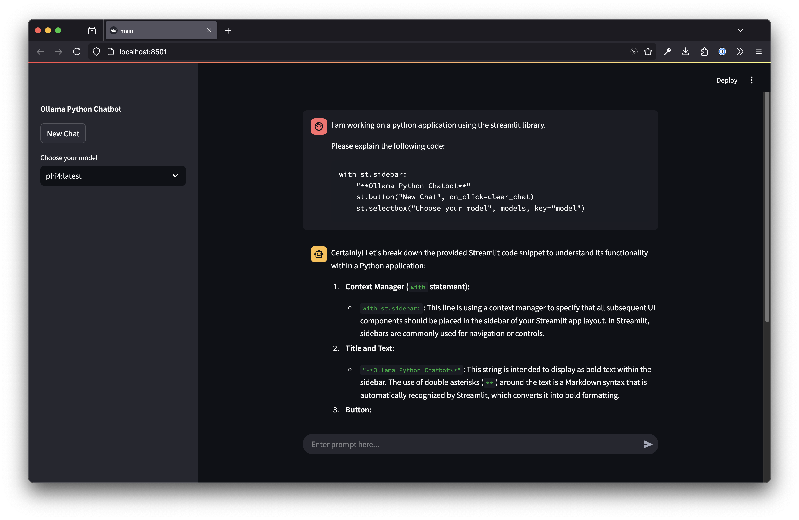

# Rapport

Rapport is a simple python LLM chatbot interface. It uses Ollama to run LLMs locally and Streamlit to create the chatbot user interface.

I built this because I'm excited by the idea that one can now (Jan 2025) run pretty competent LLM models on a laptop. While this app was originally just a learning exercise, I built enough bits that I'm using it day to day. This app is nothing special, and there are a million streamlit LLM demo chat apps around, but it's got:

- Support Ollama, Anthropic, OpenAI and IBM watsonx.
- Chat history saved for 180 days to JSON.
- File uploads.
  - Text files are supported for all models by inserting the content into the chat.
  - Image files are supported for Anthropic and OpenAI. There's an issue for [images in Ollama models][olim].
- Regenerate assistant chat messages (the models might be good, but they still emit duds!).
- Select between installed Ollama models, or use the Anthropic or watsonx services (bring your own API keys).
- Customise the system prompt by editing `systemprompt.md`.
- Export the chat as markdown:
  - Download via browser.
  - Set up folder for export (eg in Obsidian vault). Once a chat is marked for export, the exported file is updated as the chat continues.
  - Copy chat to clipboard (currently macOS only).
  - Upload to gist, when the `gh` tool is installed and authenticated.
- Generally tries to limit libraries imported.

[olim]: https://github.com/mikerhodes/rapport/issues/21



## Getting started

### Anthropic

To enable Anthropic models, set an `ANTHROPIC_API_KEY` environment variable to your Anthropic API key.

### OpenAI

To enable OpenAI models, set an `OPENAI_API_KEY` environment variable to your OpenAI API key.

### Watsonx

To enable watsonx models, set both `WATSONX_IAM_API_KEY` and `WATSONX_PROJECT` environment variables to an IAM API key (such as a personal API key) and watsonx project respectively. The watsonx project must have an associate watsonx Runtime to work (the Runtime is what runs inference, and other things, in watsonx).

### Ollama

There are many guides on the internet for installing Ollama. But I did this to install the server itself directly from GitHub:

```
curl -L \
https://github.com/ollama/ollama/releases/latest/download/ollama-darwin \
-o ollama

chmod +x ollama
```

Then it can be run with:

```
./ollama serve
```

Next download a couple of models. On a laptop with 16GB of RAM you are somewhat limited. I found the following models good, but frankly there are many to choose from:

```
ollama pull codegemma:7b
ollama pull phi4
```

The Ollama site has a list of [other available models](https://ollama.com/search)

I follow the guidance in the ollama Github README:

> You should have at least 8 GB of RAM available to run the 7B models, 16 GB to run the 13B models, and 32 GB to run the 33B models.

### Run the python chatbot user interface

I tried out [uv](https://docs.astral.sh/uv/) in this project.

```
brew install uv
```

As `uv run` installs dependencies, run the app using:

```
uv run rapport
```
