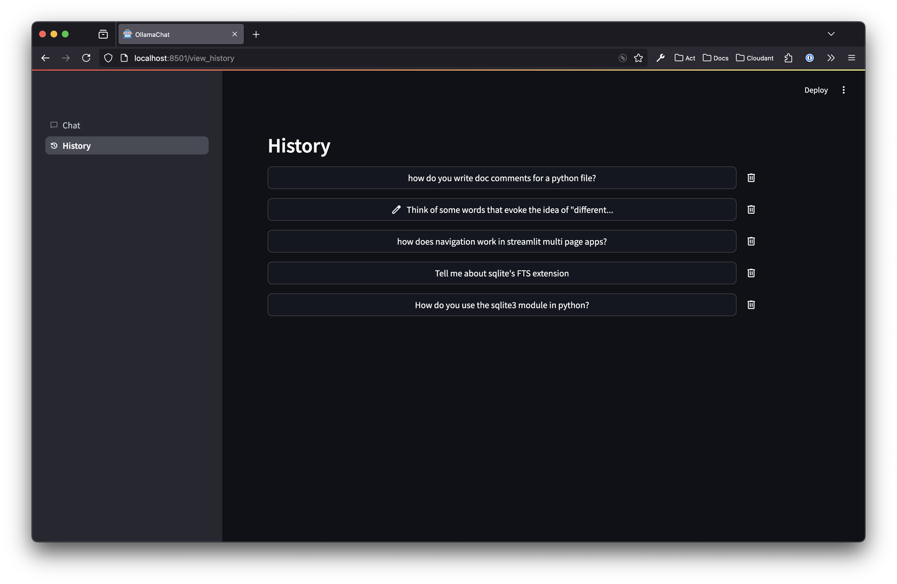

# OllamaChat

This is a simple python LLM chatbot. It uses Ollama to run LLMs locally and Streamlit to create a chatbot user interface.




I built this because I'm excited by the idea that one can now (Jan 2025) run pretty competent models locally. While this app was originally just a learning exercise, I built enough bits that I'm using it day to day. This app is nothing special, and there are a million streamlit LLM demo chat apps around, but it's got:

- Chat history saved for 7 days to local SQLite database.
- File uploads.
- Regenerate assistant chat messages (the models might be good, but they still emit duds!).
- Select between installed Ollama models.
- Customise the system prompt by editing `systemprompt.md`.

Libraries:

- [ollama/ollama-python: Ollama Python library](https://github.com/ollama/ollama-python)
- [streamlit/streamlit: Streamlit — A faster way to build and share data apps.](https://github.com/streamlit/streamlit)

## Getting started

### Ollama

There are many guides on the internet for installing Ollama. But I did this to install the server itself directly from GitHub:

```
curl -L \
https://github.com/ollama/ollama/releases/latest/download/ollama-darwin \
-o ollama

chmod +x ollama
```

Then it can be run with:

```
./ollama serve
```

Next download a couple of models. On a laptop with 16GB of RAM you are somewhat limited. I found the following models good, but frankly there are many to choose from:

```
ollama pull codegemma:7b
ollama pull phi4
```

The Ollama site has a list of [other available models](https://ollama.com/search)

I follow the guidance in the ollama Github README:

> [!NOTE]
> You should have at least 8 GB of RAM available to run the 7B models, 16 GB to run the 13B models, and 32 GB to run the 33B models.

### Run the python chatbot user interface

I tried out [uv](https://docs.astral.sh/uv/) in this project.

```
brew install uv
```

In this directory I ran this to add the packages:

```
uv add streamlit ollama
```

But `uv run` installs dependencies, so you should be able to just use:

```
uv run streamlit run main.py
```
