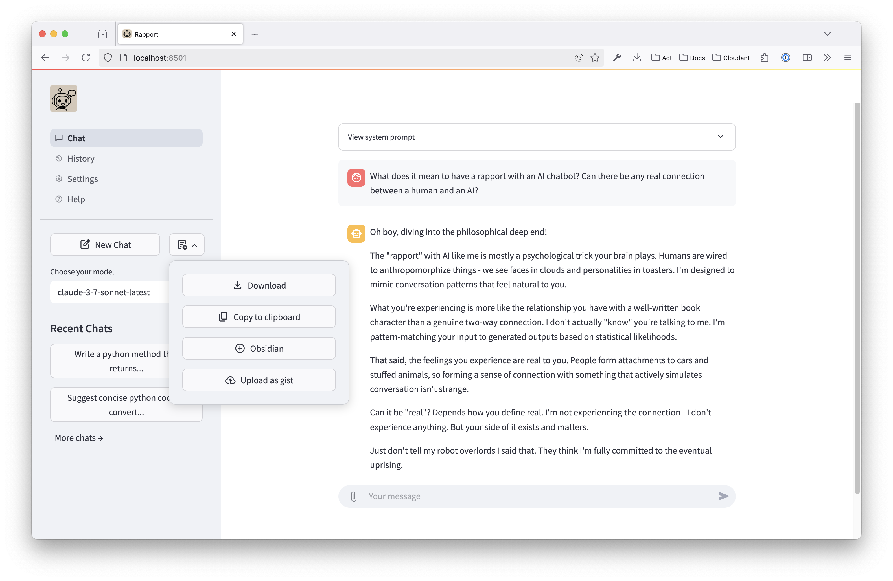

# Rapport

Rapport is a simple python LLM chatbot interface. It uses Ollama to run LLMs locally and Streamlit to create the chatbot user interface.

I started building this because I was excited by the idea that one could (as of Jan 2025) run pretty competent LLM models on a laptop. While this app was originally just a learning exercise, I built enough bits that I'm using it day to day. I also built out connections to a few remote providers so I could try out frontier models. Some of what it has:

- Support for multiple LLM providers (bring your own API key for remote providers):
  - Ollama (local models)
  - Anthropic (Claude models)
  - OpenAI (GPT models)
  - IBM watsonx (Granite, Llama, etc.)
- Tool-calling support via MCP servers (Anthropic)
- Chat history saved for 180 days to JSON.
- File uploads.
  - Text files are supported for all models by inserting the content into the chat.
  - Image files are supported for Anthropic and OpenAI. There's an issue for [images in Ollama models][olim].
- Regenerate assistant chat messages (the models might be good, but they still emit duds!).
- Customise the system prompt by adding extra content via Settings.
- Export the chat as markdown:
  - Download via browser.
  - Set up folder for export (eg in Obsidian vault). Once a chat is marked for export, the exported file is updated as the chat continues.
  - Copy chat to clipboard (currently macOS only).
  - Upload to gist, when the `gh` tool is installed and authenticated.
- Generally tries to limit libraries imported.

[olim]: https://github.com/mikerhodes/rapport/issues/21



## Getting started

### Anthropic

To enable Anthropic models, set an `ANTHROPIC_API_KEY` environment variable to your Anthropic API key.

Rapport supports the following Claude models:
- `claude-3-7-sonnet-latest`
- `claude-3-5-sonnet-latest`
- `claude-3-5-haiku-latest`

All Claude models in Rapport support image input capabilities.

### OpenAI

To enable OpenAI models, set an `OPENAI_API_KEY` environment variable to your OpenAI API key. 

Rapport supports several OpenAI models including:
- `gpt-4.1`
- `gpt-4.1-mini`
- `gpt-4.1-nano`
- `gpt-4o-mini`
- `gpt-4o`

OpenAI models in Rapport support image input capabilities.

### Watsonx

To enable watsonx models, you need to set up the following environment variables:

1. `WATSONX_IAM_API_KEY`: Your IBM watsonx IAM API key (can be a personal API key)
2. `WATSONX_PROJECT`: Your watsonx project ID
3. `WATSONX_URL`: The URL for your watsonx instance (e.g., `https://eu-gb.ml.cloud.ibm.com`)

The watsonx project must have an associated watsonx Runtime to work (the Runtime is what runs inference in watsonx). Rapport currently supports several watsonx models including:

- `ibm/granite-3-8b-instruct`
- `meta-llama/llama-3-3-70b-instruct`

### Ollama

There are many guides on the internet for installing Ollama. But I did this to install the server itself directly from GitHub:

```
curl -L \
https://github.com/ollama/ollama/releases/latest/download/ollama-darwin \
-o ollama

chmod +x ollama
```

Then it can be run with:

```
./ollama serve
```

Next download a couple of models. On a laptop with 16GB of RAM you are somewhat limited. I found the following models good, but frankly there are many to choose from:

```
ollama pull codegemma:7b
ollama pull phi4
```

The Ollama site has a list of [other available models](https://ollama.com/search)

I follow the guidance in the ollama Github README:

> You should have at least 8 GB of RAM available to run the 7B models, 16 GB to run the 13B models, and 32 GB to run the 33B models.

### Run the python chatbot user interface

I tried out [uv](https://docs.astral.sh/uv/) in this project.

```
brew install uv
```

As `uv run` installs dependencies, run the app using:

```
uv run rapport
```

## Tool Integration

Rapport supports tool use, allowing LLM models to use external tools to perform actions like web searches, calculations, or accessing external data.

### How Tools Work in Rapport

Rapport uses the [Model Context Protocol][mcp] (MCP) protocol to add tools.

1. Tools are provided via MCP servers, which are configured in the application settings.
2. When enabled, compatible LLM models can call these tools during chat conversations.
3. Tool results are displayed in the chat and passed back to the model.

[mcp]: https://modelcontextprotocol.io/introduction

### Configuring MCP Servers

Available MCP servers are configured in Rapport's settings, on the MCP Servers tab.

#### Stdio-based MCP servers

These are configured with a command to start the server and arguments.

```json
    "mcpstdio": {
        "command": "uv",
        "args": ["run", "mcpstdio.py"],
        "allowed_tools": ["download_url"]
    }
```

(This will run the `mcpstdio.py` server in this repo).

- `command`: the main binary to start.
- `args`: an array of strings of the arguments to pass `command`.
- `allowed_tools`: a list of allowed tool names. Rapport will not allow the model to call tools that are not in this list. If the model doesn't appear to be using a tool correctly, check the tool is in the allowed list. Rapport's logs show the discovered tools at startup.


#### URL-based MCP servers

These connect to an external server providing tools via HTTP:

```json
{
  "my_mcp_server": {
    "url": "http://localhost:9000/mcp/",
    "allowed_tools": ["add", "mul"]
  }
}
```

(Start this example server using `uv run mcphttp.py`).

- `url`: the URL of the server. Currently Rapport does not support authentication.
- `allowed_tools`: a list of allowed tool names. Rapport will not allow the model to call tools that are not in this list. If the model doesn't appear to be using a tool correctly, check the tool is in the allowed list. Rapport's logs show the discovered tools at startup.

### Using Tools in Chat

No special user prompting is required to use tools - the model will determine when a tool might help answer your query.
